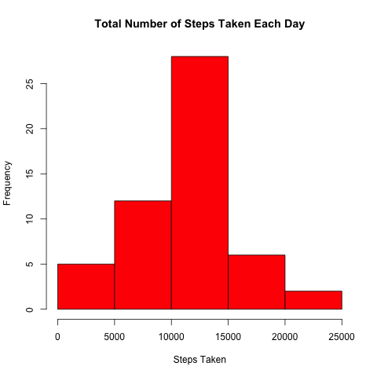
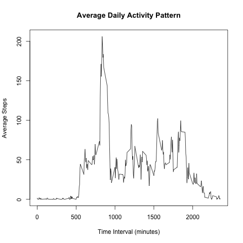

## Introduction

The purpose of this analysis is to use activity tracking data to study a group's daily activity levels.

## Loading and preprocessing the data

Before any analyses can be performed, the raw data must be converted into a suitable data format and must undergo initial pre-processing.

```{r initialization echo=TRUE}
# Load datasets library and make large float numbers more human readable (get rid of scientific notation)
library(datasets)
options("scipen"= 100, "digits" = 4 )
```

```{r read_data echo=TRUE}
# Read in the CSV, including NAs
table <- read.table ("activity.csv", header=TRUE, sep=",", na.strings="NA")
```

```{r preprocessing_data echo=TRUE}
# Convert to a datetime.  Pad the interval to four characters so we can use strptime
table$dateTime <- as.POSIXct(
  strptime (
    sprintf ('%s %04d', table$date, table$interval),
    "%Y-%m-%d %H%M"
  )
)
```

## What is mean total number of steps taken per day?

To calculate the mean total number of steps, the NA values must first be removed from the data set and the sum of daily steps must be calculated.

```{r total_daily_steps echo=TRUE}
# Sum all the daily steps -- NAs omitted
sums <- na.omit(aggregate (list (steps = table$steps), list(date = table$date), FUN = sum))
```

The **mean** and **median** values of the total daily steps can then be calculated.

```{r mean_total_daily_steps echo=TRUE eval=TRUE}
# Calculate mean of daily total steps -- NAs omitted
stepMean <- mean(sums$steps)
```
**Total Daily Steps Mean**: `r stepMean[1]`

```{r median_total_daily_steps echo=TRUE eval=TRUE}
# Calculate median of daily total steps -- NAs omitted
stepMedian <- median(sums$steps)
```
**Total Daily Steps Median**: `r stepMedian[1]`

The total number of daily steps can be visualized as a histogram plot of the frequency versus the steps taken using the R basic plotting system.
```{r total_daily_steps_plot echo=TRUE}
# Plot total number of daily steps as a histogram --NAs omitted
png(filename = "dailystepstotal.png", width = 480, height=480, units="px")
hist (sums$steps, breaks=5, main="Total Number of Steps Taken Each Day", col="red", xlab="Steps Taken", ylab="Frequency")
dev.off()
```


## What is the average daily activity pattern?

To determine the average daily activity pattern, the step data can be aggregated and the mean for each time interval can be calculated.
```{r average_daily_activity_pattern echo=TRUE}
# Average all the daily steps in each 5 minute interval
intervalAverageSteps <- aggregate(table$steps ~ table$interval, data.frame (table$steps, table$interval), FUN=mean, na.action=na.omit)
names(intervalAverageSteps)<-c("interval", "steps")
```

The average daily activity pattern can be visualized using the R base plotting system as a time series plot of each 5-minute time interval versus the average number of steps taken during that interval.

```{r average_daily_activity_pattern echo=TRUE}
# Plot Average Daily Activity Pattern -- NAs omitted
png(filename = "averagedailyactivity.png", width = 480, height=480, units="px")
interval_time_x <- intervalAverageSteps$interval
interval_steps_y <- intervalAverageSteps$steps
plot(interval_time_x,interval_steps_y, type="l", main="Average Daily Activity Pattern", xlab="Time Interval (minutes)", ylab="Average Steps")
dev.off()
```


To determine the time interval at which the maximum activity occurs, the average steps can be subsetted and the max() function applied.
```{r max_daily_activity echo=TRUE}
# Calculate maximum activity time interval
maxActivityInterval <- subset(intervalAverageSteps, steps == max(intervalAverageSteps$steps), interval)
```
**Maximum Activity Time Interval**: `r maxActivityInterval$interval`

## Imputing missing values

To calculate the missing values, one can sum the result of `r is.na(table) eval=false`
```{r missing_values echo=TRUE}
#Calculate Total Missing Values
totalMissingValues <- sum(is.na(table))
```
**Total Missing Values:** `r totalMissingValues`

To impute the missing values, a logical strategy was to replace every NA with the mean of the step values occuring during that time interval.  For example, if there was a missing value for the t=0 interval, it would be replaced with the calculated mean of all values during that time interval.  In this example, the mean at t=0 is `r intervalAverageSteps[1,2]`.

The missing data can be replaced using a for loop to iterate through row of the table and replacing any NA value with the calculated mean at the corresponding time interval index location.
```{r impute_missing_values}
# Copy Table into new Data Frame for Cleaning
tableCleaned <- table

# Loop through table and replace NAs with the average steps during that interval
for(i in 1: nrow(tableCleaned))
{
  steps <- tableCleaned$steps[i]
  if (is.na(steps))
  {
    which_row = which(intervalAverageSteps$interval == tableCleaned$interval[i])
    tableCleaned$steps[i] <- intervalAverageSteps$steps[which_row]
  }
}
```


To calculate the adjusted mean total number of steps, the sum of daily steps must be calculated.
```{r cleaned_total_daily_steps echo=TRUE}
# Sum all the daily steps from cleaned data -- NAs replaced
sumsClean <- aggregate (list (steps = tableCleaned$steps), list(date = tableCleaned$date), FUN = sum)
```

The adjusted **mean** and **median** values of the total daily steps can then be calculated.
```{r cleaned_mean_daily_total_steps echo=TRUE}
# Calculate mean of daily total steps -- NAs replaced
stepCleanMean <- mean(sumsClean$steps)
```
**Adjusted mean of daily total steps:** `r stepCleanMean`

```{r cleaned_median_daily_total_steps echo=TRUE}
# Calculate median of daily total steps -- NAs replaced
stepCleanMedian <- median(sumsClean$steps)
```
**Adjusted median of daily total Steps:** `r stepCleanMedian`

The adjusted total number of daily steps can be visualized as a histogram plot of the frequency versus the steps taken using the R basic plotting system.
```{r clean_total_daily_steps_plot echo=TRUE}
# Plot total number of daily steps as histogram -- NAs replaced
png(filename = "dailystepstotalClean.png", width = 480, height=480, units="px")
hist (sumsClean$steps, breaks=5, main="Total Number of Steps Taken Each Day", col="red", xlab="Steps Taken", ylab="Frequency")
dev.off()
```


###Analysis of Variation After Imputation

Factor | Before Imputation | After Imputation
------------- | ------------- | -------------
Mean | `r stepMean` | `r stepCleanMean`
Median | `r stepMedian` | `r stepCleanMedian`

## Are there differences in activity patterns between weekdays and weekends?

