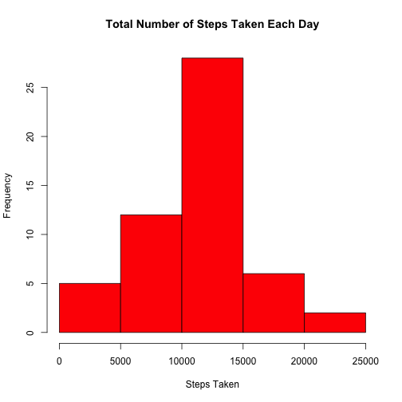
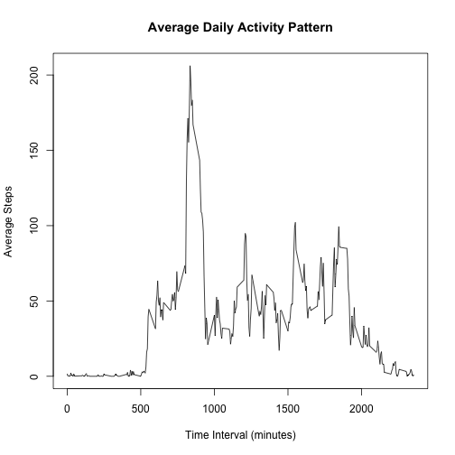
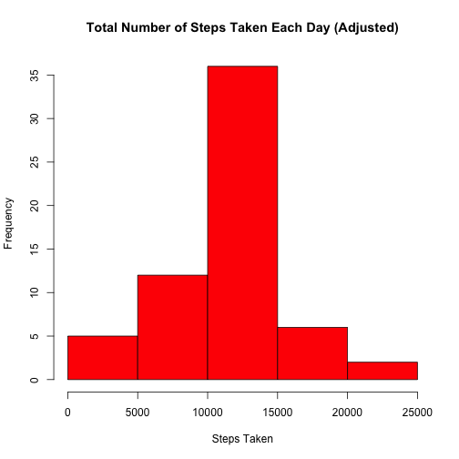
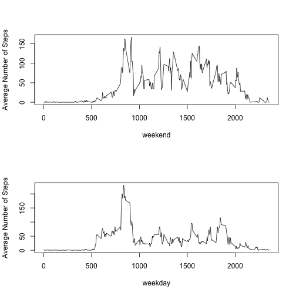

## Introduction

The purpose of this analysis is to use activity tracking data to study a group's daily activity levels.

## Loading and preprocessing the data

Before any analyses can be performed, the raw data must be converted into a suitable data format and must undergo initial pre-processing.


```r
# Load datasets library and make large float numbers more human readable (get rid of scientific notation)
library(datasets)
options("scipen"= 100, "digits" = 4 )
```


```r
# Read in the CSV, including NAs
table <- read.table ("activity.csv", header=TRUE, sep=",", na.strings="NA")
```


```r
# Convert to a datetime.  Pad the interval to four characters so we can use strptime
table$dateTime <- as.POSIXct(
  strptime (
    sprintf ('%s %04d', table$date, table$interval),
    "%Y-%m-%d %H%M"
  )
)
```

## What is mean total number of steps taken per day?

To calculate the mean total number of steps, the NA values must first be removed from the data set and the sum of daily steps must be calculated.


```r
# Sum all the daily steps -- NAs omitted
sums <- na.omit(aggregate (list (steps = table$steps), list(date = table$date), FUN = sum))
```

The **mean** and **median** values of the total daily steps can then be calculated.


```r
# Calculate mean of daily total steps -- NAs omitted
stepMean <- mean(sums$steps)
```
**Total Daily Steps Mean**: 10766.1887


```r
# Calculate median of daily total steps -- NAs omitted
stepMedian <- median(sums$steps)
```
**Total Daily Steps Median**: 10765

The total number of daily steps can be visualized as a histogram plot of the frequency versus the steps taken using the R basic plotting system.

```r
hist (sums$steps, breaks=5, main="Total Number of Steps Taken Each Day", col="red", xlab="Steps Taken", ylab="Frequency")
```

 

## What is the average daily activity pattern?

To determine the average daily activity pattern, the step data can be aggregated and the mean for each time interval can be calculated.

```r
# Average all the daily steps in each 5 minute interval
intervalAverageSteps <- aggregate(table$steps ~ table$interval, data.frame (table$steps, table$interval), FUN=mean, na.action=na.omit)
names(intervalAverageSteps)<-c("interval", "steps")
```

The average daily activity pattern can be visualized using the R base plotting system as a time series plot of each 5-minute time interval versus the average number of steps taken during that interval.


```r
# Plot Average Daily Activity Pattern -- NAs omitted
interval_time_x <- intervalAverageSteps$interval
interval_steps_y <- intervalAverageSteps$steps
plot(interval_time_x,interval_steps_y, type="l", main="Average Daily Activity Pattern", xlab="Time Interval (minutes)", ylab="Average Steps")
```

 
To determine the time interval at which the maximum activity occurs, the average steps can be subsetted and the max() function applied.

```r
# Calculate maximum activity time interval
maxActivityInterval <- subset(intervalAverageSteps, steps == max(intervalAverageSteps$steps), interval)
```
**Maximum Activity Time Interval**: 835

## Imputing missing values

To calculate the missing values, one can sum the result of ``is.na(table)``

```r
#Calculate Total Missing Values
totalMissingValues <- sum(is.na(table))
```
**Total Missing Values:** 2304

To impute the missing values, a logical strategy was to replace every NA with the mean of the step values occuring during that time interval.  For example, if there was a missing value for the t=0 interval, it would be replaced with the calculated mean of all values during that time interval.  In this example, the mean at t=0 is 1.717.

The missing data can be replaced using a for loop to iterate through row of the table and replacing any NA value with the calculated mean at the corresponding time interval index location.

```r
# Copy Table into new Data Frame for Cleaning
tableCleaned <- table

# Loop through table and replace NAs with the average steps during that interval
for(i in 1: nrow(tableCleaned))
{
  steps <- tableCleaned$steps[i]
  if (is.na(steps))
  {
    which_row = which(intervalAverageSteps$interval == tableCleaned$interval[i])
    tableCleaned$steps[i] <- intervalAverageSteps$steps[which_row]
  }
}
```


To calculate the adjusted mean total number of steps, the sum of daily steps must be calculated.

```r
# Sum all the daily steps from cleaned data -- NAs replaced
sumsClean <- aggregate (list (steps = tableCleaned$steps), list(date = tableCleaned$date), FUN = sum)
```

The adjusted **mean** and **median** values of the total daily steps can then be calculated.

```r
# Calculate mean of daily total steps -- NAs replaced
stepCleanMean <- mean(sumsClean$steps)
```
**Adjusted mean of daily total steps:** 10766.1887


```r
# Calculate median of daily total steps -- NAs replaced
stepCleanMedian <- median(sumsClean$steps)
```
**Adjusted median of daily total Steps:** 10766.1887

The adjusted total number of daily steps can be visualized as a histogram plot of the frequency versus the steps taken using the R basic plotting system.

```r
# Plot total number of daily steps as histogram -- NAs replaced
hist (sumsClean$steps, breaks=5, main="Total Number of Steps Taken Each Day (Adjusted)", col="red", xlab="Steps Taken", ylab="Frequency")
```

 
###Analysis of Variation After Imputation

Factor | Before Imputation | After Imputation | Difference
------------- | ------------- | ------------- | -------------
**Mean** | 10766.1887 | 10766.1887 | 0
**Median** | 10765 | 10766.1887 | 1.1887

**Interpretation:**
Data imputation using interval mean values does not appear to have created a significant difference between unadjusted and adjusted mean and median data set values.

## Are there differences in activity patterns between weekdays and weekends?

To determine if there are any differences in the activity patterns on weekdays versus weekends, it is first necessary to categorize each interval range based on the appropriate day type.

Created a new column with the day of the week:

```r
# Add Day of Week column to Data Frame
tableCleaned$day <- weekdays(tableCleaned$dateTime, abbreviate = TRUE)

# Create a character vector that contains the abbreviated days of the week
day <- c("Mon", "Tue", "Wed", "Thu", "Fri", "Sat", "Sun")

# Subset by day type using indexes (weekday or weekend)
weekday <- day[1:5]
weekend <- day[6:7]

# Create a dayType column in data frame
tableCleaned$dayType <- weekdays(tableCleaned$dateTime, abbreviate = TRUE)

# Divide dayType factor into two levels
levels(tableCleaned$dayType) <- c("Weekday", "Weekend")

# Collapse factor by level type
tableCleaned$dayType[tableCleaned$day %in% weekday] <- "Weekday"
tableCleaned$dayType[tableCleaned$day %in% weekend] <- "Weekend"

# Store subsets of the imputed data categorized by dayType (weekday or weekend)
stepsWeekday <- subset(tableCleaned, dayType == "Weekday", c("steps", "interval"))
stepsWeekend <- subset(tableCleaned, dayType == "Weekend", c("steps", "interval"))

# Calculate means by interval for each of the two level subsets (weekday or weekend)
intervalStepsWeekday <- aggregate(list (steps = stepsWeekday$steps), list (interval = stepsWeekday$interval), FUN = mean)
intervalStepsWeekend <- aggregate(list (steps = stepsWeekend$steps), list (interval = stepsWeekend$interval), FUN = mean)
```


The average daily activity pattern can be visualized using the R base plotting system as a time series plot of each 5-minute time interval versus the average number of steps taken during that interval as a function of day type.

```r
# Plot average number of steps taken on weekdays and weekends -- NAs replaced
par(mfrow = c(2,1))

plot(intervalStepsWeekend$interval, intervalStepsWeekend$steps, type="l", xlab="weekend", ylab="Average Number of Steps")
plot(intervalStepsWeekday$interval, intervalStepsWeekday$steps, type="l", xlab="weekday", ylab="Average Number of Steps")
```

 
**Interpretation:**
Through visual comparison of weekend and weekday activity pattern plots, there do seem to be differences in observed activity levels between the two day categories.
